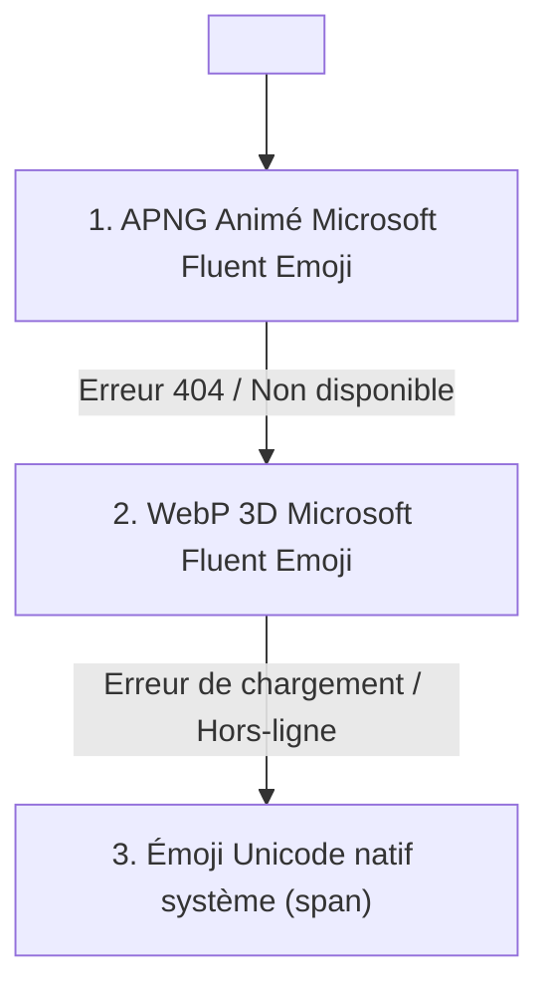

# Documentation Technique : Migration vers Microsoft Fluent Emoji

Ce document consigne la mise à niveau du système d'illustrations de l'application **Mot Magique**, remplaçant l'affichage statique des émojis Unicode système par la bibliothèque **Microsoft Fluent Emoji** en mode animé avec repli 3D et émoji natif.

---

## 1. Objectifs & Bénéfices

* **Identité visuelle captivante pour les enfants (CP / CE1)** : Les visuels animés (APNG) et 3D (WebP) apportent un rendu vivant, chaleureux et ludique, particulièrement valorisant pour le jeu et l'album d'autocollants.
* **Uniformité multiplateforme** : Suppression des disparités d'affichage entre Android, iOS, Windows et ChromeOS (plus aucun rectangle cassé ni rendu noir et blanc).
* **Licence commerciale 100 % libre (MIT)** : Les assets Microsoft Fluent Emoji sont publiés sous licence **MIT**, autorisant une exploitation commerciale ou une mise sous paywall de l'application sans redevance ni restriction.
* **Zéro surcoût de bundle** : Les assets sont chargés à la demande (*lazy-loaded*) depuis le CDN haute disponibilité jsDelivr (Cloudflare), sans alourdir le poids du code JavaScript de l'application.

---

## 2. Architecture & Chaîne de Repli (Fallback Cascade)

Le système repose sur un mécanisme de cascade robuste à trois niveaux :

1. **Niveau 1 : APNG Animé (Animated Fluent Emoji)**
   * Source : `Tarikul-Islam-Anik/Animated-Fluent-Emojis` servi par jsDelivr.
   * Plus de 98 % des mots disposent d'un visuel animé officiel Microsoft.
2. **Niveau 2 : WebP 3D (Fluent Emoji 3D)**
   * Source : `@lobehub/fluent-emoji-3d` servi par jsDelivr.
   * Couverture de 100 % sur l'intégralité des 524 mots de la base. Fichiers ultra légers (~5 Ko par icône).
3. **Niveau 3 : Émoji Unicode Système**
   * Repli automatique via `onError` sur balise `` avec attributs d'accessibilité `role="img"`.

---

## 3. Fichiers créés

### `src/utils/fluentEmojiMap.js`
Table statique précalculée contenant les métadonnées de correspondance pour l'ensemble des 341 émojis utilisés par l'application :
* `hex` : Identifiant hexadécimal normalisé Unicode (prenant en compte les sélecteurs de variation `fe0f`).
* `anim` : Chemin relatif de l'image animée dans la bibliothèque.

### `src/utils/fluentEmoji.js`
Module utilitaire exportant :
* `getFluentEmojiUrls(emoji)` : Résout les URLs complètes pour le mode animé, le mode 3D et le mode SVG plat.
* `emojiToHex(emoji)` : Générateur dynamique d'identifiant hexadécimal pour supporter tout émoji supplémentaire à l'avenir.

### `src/components/FluentEmoji.jsx`
Composant React autonome :
* Propriétés : `emoji`, `alt`, `className`, `mode` (`'animated'` | `'3d'` | `'native'`).
* Gestion dynamique du cycle de vie des images et bascule automatique en cas d'échec réseau.
* Optimisé avec `loading="lazy"` et `decoding="async"`.

---

## 4. Composants mis à jour

| Composant | Rôle | Intégration Fluent Emoji |
| :--- | :--- | :--- |
| [`ModeGuess.jsx`](file:///root/apps/mot-magique/src/components/ModeGuess.jsx) | Jeu *Devine & Écris* | Carte centrale du mot à deviner |
| [`ModeScrabble.jsx`](file:///root/apps/mot-magique/src/components/ModeScrabble.jsx) | Jeu *Scrabble Junior* | Carte d'illustration au-dessus du mot |
| [`ModeMissingLetter.jsx`](file:///root/apps/mot-magique/src/components/ModeMissingLetter.jsx) | Jeu *Lettre Mystère* | Carte d'illustration principale |
| [`ModeSyllables.jsx`](file:///root/apps/mot-magique/src/components/ModeSyllables.jsx) | Jeu *Train des Syllabes* | Illustration du mot découpé |
| [`ModeSentenceBuilder.jsx`](file:///root/apps/mot-magique/src/components/ModeSentenceBuilder.jsx) | Jeu *Phrases Magiques* | Mascotte thématique de la phrase |
| [`ModeMemory.jsx`](file:///root/apps/mot-magique/src/components/ModeMemory.jsx) | Jeu *Mémory Phonétique* | Faces illustrées des cartes retournées |
| [`StickerAlbum.jsx`](file:///root/apps/mot-magique/src/components/StickerAlbum.jsx) | *Mon Grand Imagier* | Autocollants débloqués dans l'album |
| [`ModeHangman.jsx`](file:///root/apps/mot-magique/src/components/ModeHangman.jsx) | Jeu *Sauve la Mascotte* | Révélation du mot gagné ou perdu |
| [`ModeFreeWriting.jsx`](file:///root/apps/mot-magique/src/components/ModeFreeWriting.jsx) | Jeu *Ardoise Magique* | Boutons de suggestions d'inspiration |
| [`ModeMaths.jsx`](file:///root/apps/mot-magique/src/components/ModeMaths.jsx) | *L'Atelier des Maths* | Éléments visuels des problèmes écrits |

---

## 5. Vérification & Tests

* **Build de production** : `npm run build` exécuté avec succès (compilation Vite sans erreurs).
* **Analyse statique** : `npm run lint` validé (0 erreurs).
